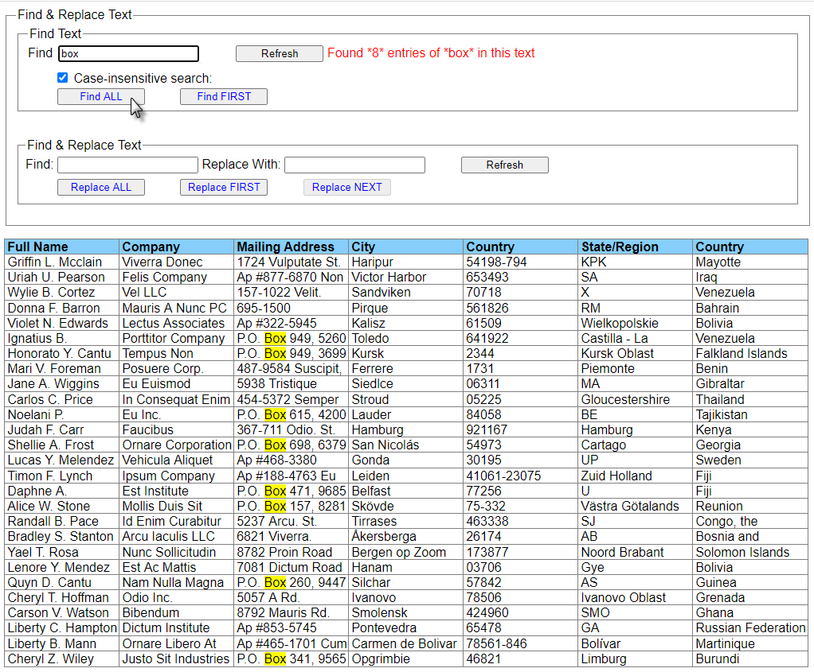
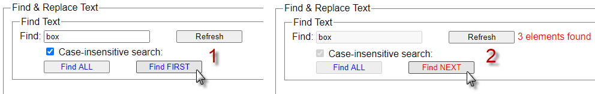
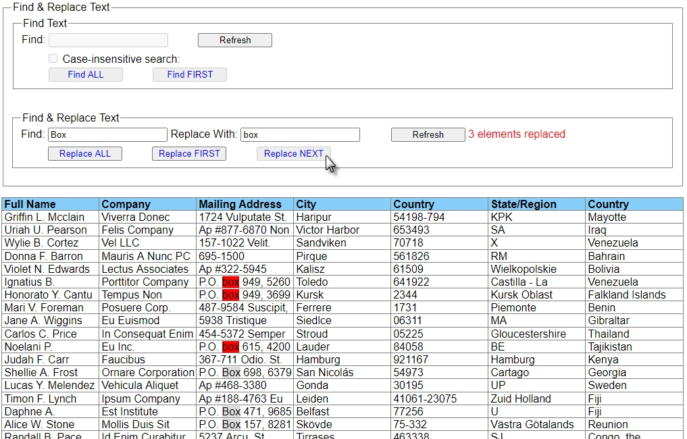

link:  https://ev-ran.github.io/Find-and-Replace-project/
## Find & Replace Features
### Find Text
  *  Case-sensitive and case-insensitive search
  *  Find all  and find one by one
  *  Highlight with color for found text elements
  * Display information: how many items were found
  * One button for two functions: Find FIRST   and Find  NEXT
  * UX:  misuse prevention logic 
 
### Find / Replace Text
  *  Define texts for Search and Replace
  *  Find and replase all  and one by one
  *  Highlight with color for found and replaced text elements
  * Display information: how many items were replaced
  * UX:  misuse prevention logic 

###  Find

###  Find and replace

